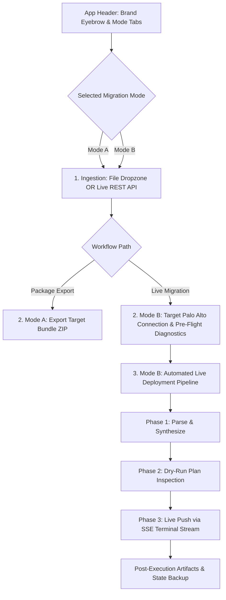

# Website & Application Design System: CTC Global Malaysia
**Product**: FortiGate to Palo Alto Networks Automated Migration Engine (`fg2pan`)  
**Design Reference**: [CTC Global Malaysia](https://www.ctc-g.com.my/)  
**Document**: `DESIGN.md`  
**Version**: 2.0 (Enterprise IT Solutions & Application UI/UX Specification)

---

## 1. Executive Summary & Brand Foundation

### 1.1 Company & Brand Overview
**CTC Global Sdn Bhd (Malaysia)** is a premier enterprise IT solutions provider and systems integrator with over 50 years of IT service history in Malaysia. CTC Global leads digital transformation across five foundational technology pillars:
1. **AI Infrastructure**
2. **Hybrid Cloud Computing**
3. **Cybersecurity & Network Defense**
4. **Modern Data Protection**
5. **Digital Workplace**

### 1.2 Application Scope: FortiGate to Palo Alto Migration Engine
The **PAN-OS Migration Engine** is a production-grade enterprise application developed under the **Cybersecurity & Cloud Infrastructure Practice**. It automates the parsing, transformation, pre-flight diagnostics, and live deployment of FortiGate configurations into native Palo Alto Networks (PAN-OS) XML rulesets and modular Terraform (`PaloAltoNetworks/panos`) infrastructure code.

### 1.3 Design Tone & Persona
- **Brand Persona**: Authoritative, High-Tech, Precision Engineering, Zero-Touch Automation Assurance.
- **Aesthetic**: Modern Tech Dark Cockpit with glassmorphic depth (`backdrop-filter: blur(18px)`), vibrant CTC Cyan (`#0087cc`) primary highlights, deep corporate navy foundations (`#0e4e95`), and distinct functional accents derived from CTC's core competency pillars.

---

## 2. Design System & Design Tokens

### 2.1 Color Palette & Token System

```
┌──────────────────────────────┬─────────────┬────────────────────────────────────────────────────────┐
│ Design Token                 │ Hex / Value │ Role & UI Application                                  │
├──────────────────────────────┼─────────────┼────────────────────────────────────────────────────────┤
│ --color-primary              │ #0087cc     │ CTC Primary Cyan Blue; Primary CTAs, active highlights │
│ --color-primary-hover        │ #0284c7     │ Hover state for primary buttons and interactive tabs   │
│ --color-primary-light        │ #38bdf8     │ Glow accents, active badges, code token highlights     │
│ --color-primary-glow         │ rgba(0,...) │ 0 10px 25px -4px rgba(0, 135, 204, 0.35)               │
│ --color-secondary            │ #0e4e95     │ CTC Corporate Navy; Gradient stops, secondary accents  │
│ --color-cyber                │ #999ccd     │ CTC Cybersecurity Pillar Accent (Lavender Indigo)      │
│ --color-teal                 │ #3cb994     │ CTC Digital Workplace Pillar Accent / Success State    │
│ --color-green                │ #95ca64     │ CTC Hybrid Cloud Pillar Accent / Resource Addition (+) │
│ --color-pink                 │ #f17c95     │ CTC Data Protection Pillar Accent / Danger & Destroys  │
│ --warning                    │ #f59e0b     │ Warning badges, dry-run change indicator (~)           │
│ --bg-dark                    │ #070e1c     │ Deep Enterprise Midnight Background                    │
│ --bg-surface                 │ #0b172c     │ Secondary surface background                           │
│ --bg-card                    │ rgba(11,..) │ rgba(11, 23, 44, 0.82) with 18px backdrop blur         │
│ --border-subtle              │ rgba(0,...) │ rgba(0, 135, 204, 0.18) card border strokes            │
│ --border-hover               │ rgba(0,...) │ rgba(0, 135, 204, 0.45) focused/hovered border stroke  │
│ --text-main                  │ #ffffff     │ Primary high-contrast body & title text                │
│ --text-heading               │ #f8fafc     │ Section and card title typography                      │
│ --text-muted                 │ #94a3b8     │ Secondary copy, subtitles, helper descriptions         │
│ --text-dim                   │ #64748b     │ Disabled states, subtle metadata, footer text          │
└──────────────────────────────┴─────────────┴────────────────────────────────────────────────────────┘
```

---

### 2.2 Typography System

```css
:root {
  /* Headings, Brand Title, Badges, Tabs */
  --font-display: 'Poppins', -apple-system, BlinkMacSystemFont, 'Segoe UI', Roboto, sans-serif;
  
  /* Form Controls, Body Copy, General UI */
  --font-ui: 'Roboto', 'Inter', -apple-system, BlinkMacSystemFont, 'Segoe UI', sans-serif;
  
  /* Code Blocks, CLI Terminal, JSON/XML/HCL, Diagnostic Logs */
  --font-mono: 'JetBrains Mono', 'Roboto Mono', ui-monospace, SFMono-Regular, monospace;
}
```

#### Scale & Hierarchy
| Level | Font Family | Size / Weight | Application |
| :--- | :--- | :--- | :--- |
| **Brand Eyebrow** | `Poppins` | `0.72rem (11.5px)` / `700` (Uppercase) | CTC Global practice tag & company banner |
| **Main Title (H1)** | `Poppins` | `1.65rem (26.4px)` / `700` | Application header brand title |
| **Card Headings (H2)** | `Poppins` | `1.35rem (21.6px)` / `700` | Step titles (`1. Ingestion`, `2. Connection`, `3. Pipeline`) |
| **Subheadings (H3 / H4)** | `Poppins` | `1.0rem - 1.15rem` / `600` | Dropzone header, readiness grid header |
| **Form Labels** | `Poppins` | `0.85rem (13.6px)` / `600` | Input field labels, authentication method selector |
| **Body / Descriptions** | `Roboto` / `Inter` | `0.92rem (14.7px)` / `400` | Card descriptions, feature summaries |
| **Terminal Output** | `JetBrains Mono` | `0.85rem (13.6px)` / `400-600` | Real-time SSE streaming deployment logs |
| **Badges & Metrics** | `JetBrains Mono` | `0.76rem (12px)` / `600` | `+ add`, `~ change`, `- destroy`, status badges |

---

## 3. UI/UX Component & Interaction Architecture



---

### 3.1 Header & Brand Eyebrow
- **Brand Eyebrow**: Displays `CTC GLOBAL • Cybersecurity & Cloud Infrastructure`.
- **Title**: `PAN-OS Migration Engine (FortiGate to Palo Alto)` featuring a cyan-to-lavender gradient text accent (`#38bdf8 -> #0087cc -> #999ccd`).
- **Pill Badge**: Shows live engine status (`v2.5 • Enterprise Automation`) with an animated emerald pulse indicator (`#3cb994`).
- **Mode Tabs Switcher**: Dual-tab glassmorphic container for switching between:
  1. `Package Export (XML & Terraform)`
  2. `Direct Live Migration (Terraform Push)`

---

### 3.2 Step 1: FortiGate Configuration Ingestion
Dual-method ingestion card with instant sub-tab toggle:
1. **Method A: File Dropzone (`#ingest-file-container`)**:
   - Drag-and-drop support with hover border glow (`rgba(0, 135, 204, 0.4)`).
   - Instant file inspection displaying filename, formatted byte size (`KB / MB`), and one-click clear button.
   - Accepts FortiOS 6.x and 7.x `.conf`, `.txt`, `.cfg` backup files.
2. **Method B: Live REST API Ingestion (`#ingest-api-container`)**:
   - Direct connection form with FortiGate Host/IP, HTTPS Port, VDOM, Strict SSL toggle.
   - Dual authentication options: **REST API Token** or **Admin Username & Password**.
   - Password fields equipped with interactive show/hide toggle buttons (`👁️`).
   - Live extraction trigger pulling address objects, interfaces, policies, and NAT rules with real-time stats summary card.

---

### 3.3 Mode A: Export Target Migration Bundle Card
- **3-Pillar Feature Showcase**:
  1. **PAN-OS XML Configuration** (Cyan `#0087cc` badge icon): Native XML ready for Panorama / Firewall WebGUI import.
  2. **Modular Terraform Suite** (Cyber Lavender `#999ccd` badge icon): Production HCL (`main.tf`, `provider.tf`, `variables.tf`, `terraform.tfvars`).
  3. **Unified Migration Audit Report** (Teal `#3cb994` badge icon): Parity audit matrices and security profile mappings.
- **Action CTA**: Full-width primary button with loading spinner state triggering direct archive download (`migration_results.zip`).

---

### 3.4 Mode B: Target Firewall Connection & Pre-Flight Diagnostics
- **Palo Alto Connection Form**:
  - Target Management Host/IP, Port, VSYS (`vsys1`), Device Group (`shared`), SSL Enforcement.
  - Authentication options: **XML API Key** (Recommended) or **Admin Username/Password**.
- **Pre-Flight Readiness Grid**:
  - 4 automated health check tiles with animated status dots:
    1. `Terraform Engine` (CLI binary availability & execution permissions)
    2. `PaloAltoNetworks Provider` (Registry access & schema validation)
    3. `Management Port Reachability` (TCP port 443 socket probe)
    4. `PAN-OS XML Auth & Licensing` (API key authentication verification)
  - Color-coded status feedback:
    - Pending: `#64748b` (Neutral Gray)
    - Running: `#0087cc` (Cyan Pulse)
    - Success: `#3cb994` (Emerald Teal)
    - Failed: `#f17c95` (Rose Pink)

---

### 3.5 Mode B: Automated Live Deployment Pipeline
A 3-phase execution pipeline with gated button progression:
1. **Phase 1: Parse & Synthesize (`btnPrepare`)**:
   - Generates isolated workspace sandbox and compiles HCL configuration files.
2. **Phase 2: Dry-Run Inspection (`btnPlan`)**:
   - Executes `terraform plan` to calculate resource delta.
   - Displays dynamic summary badges:
     - `+ X to add` (`#95ca64` Green)
     - `~ Y to change` (`#f59e0b` Amber)
     - `- Z to destroy` (`#f17c95` Coral Pink)
3. **Phase 3: Live Push (`btnApply`)**:
   - Prompts confirmation dialog and initiates live push via Server-Sent Events (SSE).
   - Locks controls to prevent concurrent execution.

---

### 3.6 Real-Time SSE Deployment Terminal
- **macOS/CLI Inspired Header**: Red, Yellow, and Green window controls, stream title (`LIVE DEPLOYMENT STREAM (SSE)`), auto-scroll toggle, and clear button.
- **Syntax Highlighting**:
  - `[SYSTEM]` / `[INFO]`: Cyan Blue (`#38bdf8`)
  - `[SUCCESS]`: Emerald Green (`#34d399`)
  - `[ERROR]` / `[FAILED]`: Coral Red (`#f87171`)
  - `[WARNING]`: Amber Yellow (`#fbbf24`)
  - `[PLAN]`: Lavender Purple (`#a78bfa`)
- **Custom Terminal Scrollbar**: Styled slim thumb with hover contrast.

---

### 3.7 Post-Execution State & Artifact Download Bar
- Appears automatically upon successful live deployment.
- Displays `✓ Deployment Complete` badge.
- Instant access to:
  - `Download .tfstate` (Current live state record)
  - `Download Full Bundle (.zip)` (Complete Terraform workspace & XML rulesets)

---

### 3.8 Enterprise Footer
- Professional corporate signature:
  - `CTC Global Sdn Bhd • Enterprise Network & Cybersecurity Automation Practice`
  - `PAN-OS 10.x / 11.x Compatible • Terraform Provider PaloAltoNetworks/panos`

---

## 4. Responsive Design & Layout Breakpoints

| Breakpoint | Target Screen | Layout Behavior |
| :--- | :--- | :--- |
| **> 900px (Desktop)** | Standard & Widescreen Monitors | 3-column bundle cards, 4-column diagnostic grid, side-by-side form grids |
| **641px - 900px (Tablet)** | iPad, Tablets, Small Laptops | 2-column diagnostic grid, stacked bundle cards, 12-column full-width form inputs |
| **<= 640px (Mobile)** | Smartphones | Single-column stack, vertical mode tabs, full-width step buttons, compact padding |

---

## 5. Verification & Quality Assurance

- **Functional Parity**: 100% test coverage across all parser, transformer, report generator, runner, and Flask API endpoints (57/57 unit & integration tests passing).
- **CSS Token Consistency**: All visual styling relies on semantic CSS custom properties matching CTC Global's brand guidelines.
- **Zero-Shift Interactions**: Password toggle buttons, error banners, and dropzone states operate with zero cumulative layout shift (CLS).
