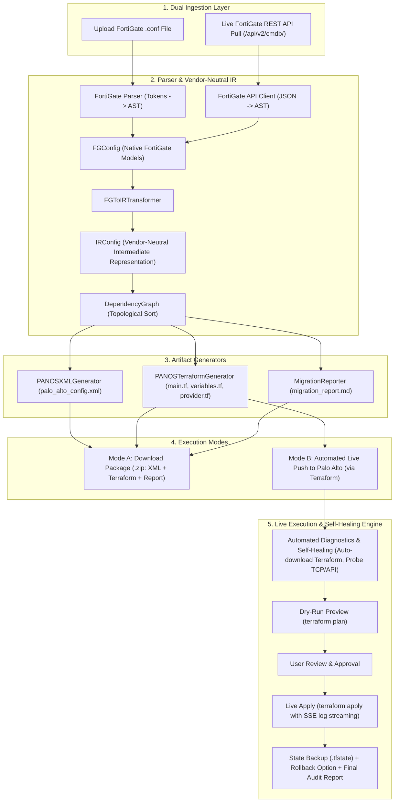

# 🚀 Comprehensive Execution Plan: Automated Terraform Live Migration Engine

This document is the complete architectural specification and implementation blueprint for extending the **FortiGate to Palo Alto Networks Migration Toolkit** with automated Terraform generation, self-healing pre-flight diagnostics, and live real-time web deployment.

---

## 🏗️ Architectural Overview & Dual-Mode Pipeline



---

## 📋 Detailed Phase-by-Phase Implementation Blueprint

---

### Phase 1: Terraform Artifact Generator (Backend)

#### 1.1 Objective
Convert the vendor-neutral `IRConfig` into idiomatic, production-ready HashiCorp Terraform configuration (`.tf`) leveraging the official [`PaloAltoNetworks/panos`](https://registry.terraform.io/providers/PaloAltoNetworks/panos/latest/docs) provider (v1.13.0+).

#### 1.2 Files to Create / Modify
- **`[NEW]` `src/fg2pan/generator/panos_terraform.py`**: The core HCL generator implementing `BaseGenerator`.
- **`[MODIFY]` `src/fg2pan/generator/base.py`**: Ensure `MigrationArtifact` handles multi-file Terraform bundles.
- **`[MODIFY]` `src/fg2pan/main.py`**: Enable `migrate --format terraform`.

#### 1.3 Resource Mapping Specifications
| IR Object (`IRConfig`) | Target Terraform Resource | Provider Attributes |
| :--- | :--- | :--- |
| `IRAddress` (`network`, `host`) | `panos_address_object` | `name`, `value = "<ip_netmask>"`, `type = "ip-netmask"`, `vsys` / `device_group` |
| `IRAddress` (`range`) | `panos_address_object` | `name`, `value = "<start>-<end>"`, `type = "ip-range"` |
| `IRAddress` (`fqdn`, `wildcard`) | `panos_address_object` | `name`, `value = "<fqdn>"`, `type = "fqdn"` |
| `IRAddressGroup` | `panos_address_group` | `name`, `static_entries = [panos_address_object.<id>.name]`, `description` |
| `IRService` | `panos_service_object` | `name`, `protocol = "tcp|udp"`, `destination_port = "<port>"`, `description` |
| `IRServiceGroup` | `panos_service_group` | `name`, `services = [panos_service_object.<id>.name]`, `description` |
| `IRPolicy` | `panos_security_rule_group` / `panos_security_policy` | `rule { name, source_zones, destination_zones, source_addresses, destination_addresses, applications = ["any"], services, action = "allow|deny" }` |
| `IRNATRule` | `panos_nat_rule_group` / `panos_nat_policy` | `rule { name, source_zones, destination_zones, source_addresses, destination_addresses, dynamic_ip_and_port { translated_address = ... } }` |
| `IRZone` | `panos_zone` | `name`, `mode = "layer3"`, `interfaces = [...]` |
| `IRRoute` | `panos_static_route_ipv4` | `name`, `destination = "<cidr>"`, `nexthop = "<ip>"`, `interface = "<name>"`, `metric` |

#### 1.4 Generated Terraform File Layout
When `PANOSTerraformGenerator.generate(ir)` is called, it produces:
1. `provider.tf`: Declares `required_providers { panos = { source = "PaloAltoNetworks/panos" } }` and parameterizes provider block.
2. `variables.tf`: Declares variables for `panos_hostname`, `panos_api_key`, `panos_username`, `panos_password`, `panos_vsys`, `panos_device_group`.
3. `main.tf`: Contains ordered definitions of objects, groups, services, zones, security rules, and NAT rules.
4. `terraform.tfvars.example`: Example credentials and host variables file.

#### 1.5 Reference Code
- Refer to `fortigate-palo-migration-main/fortigate_palo_converter.py` (lines 788–1350) for name sanitation rules (`sanitize_name`, `panos_object_name`) and resource attribute logic.

---

### Phase 2: Automated Terraform Execution & Diagnostics Engine

#### 2.1 Objective
Provide a zero-dependency, self-healing execution environment that automatically verifies prerequisites, downloads missing binaries, tests connectivity, runs dry-run plans, and executes live deployments with real-time log streaming.

#### 2.2 Files to Create / Modify
- **`[NEW]` `src/fg2pan/engine/binary_manager.py`**: Auto-detects and auto-downloads the standalone `terraform` binary.
- **`[NEW]` `src/fg2pan/engine/diagnostics.py`**: Pre-flight network, registry, and credentials probe.
- **`[NEW]` `src/fg2pan/engine/runner.py`**: Manages isolated sandbox directories, subprocess execution, and SSE log streaming.

#### 2.3 Subsystem Implementations

```
┌────────────────────────────────────────────────────────────────────────┐
│                        engine/binary_manager.py                        │
├────────────────────────────────────────────────────────────────────────┤
│ 1. Check system PATH via shutil.which("terraform")                     │
│ 2. Check local project bin/ folder (e.g. ./bin/terraform.exe)          │
│ 3. If missing:                                                         │
│    - Detect platform: Windows (amd64/arm64), Linux (amd64), macOS      │
│    - Download: https://releases.hashicorp.com/terraform/1.9.5/...zip   │
│    - Extract binary to ./bin/ and chmod +x on Unix                     │
│ 4. Return absolute path to binary                                      │
└────────────────────────────────────────────────────────────────────────┘
```

```
┌────────────────────────────────────────────────────────────────────────┐
│                         engine/diagnostics.py                          │
├────────────────────────────────────────────────────────────────────────┤
│ 1. check_terraform(): Verifies binary version & execution              │
│ 2. check_registry(): HTTP HEAD request to registry.terraform.io        │
│ 3. check_palo_alto_line_of_sight(host, port=443, timeout=3):           │
│    - Socket TCP connect probe                                          │
│ 4. check_palo_alto_auth(host, api_key=None, username=None, pass=None):│
│    - HTTPS probe: /api/?type=version or /api/?type=op&cmd=<show>...    │
│    - Returns PAN-OS version, model, serial, and active VSYS list       │
└────────────────────────────────────────────────────────────────────────┘
```

```
┌────────────────────────────────────────────────────────────────────────┐
│                           engine/runner.py                             │
├────────────────────────────────────────────────────────────────────────┤
│ 1. create_sandbox(session_id, tf_files, tfvars):                       │
│    - Writes .tf and terraform.tfvars into scratch/sessions/<id>/       │
│ 2. run_init(): subprocess 'terraform init -no-color'                   │
│ 3. run_plan(): subprocess 'terraform plan -no-color -out=tfplan'       │
│    - Extracts resource plan summary: "+ 396 to add, 0 to change"       │
│ 4. run_apply_stream():                                                 │
│    - Subprocess 'terraform apply -no-color -auto-approve tfplan'       │
│    - Yields real-time stdout/stderr lines with SSE formatting          │
│ 5. backup_state(): Copies terraform.tfstate for rollback & history     │
└────────────────────────────────────────────────────────────────────────┘
```

---

### Phase 3: Web Interface & Real-Time Live Migration UI

#### 3.1 Objective
Upgrade the web interface into an interactive migration console supporting both download mode and live push mode with embedded terminal log viewer and pre-flight diagnostics cards.

#### 3.2 Files to Create / Modify
- **`[MODIFY]` `src/fg2pan/web.py`**:
  - `POST /api/diagnostics`: Runs `PaloAltoDiagnostics` and returns JSON health status.
  - `POST /api/terraform/prepare`: Generates `.tf` files and creates isolated session.
  - `POST /api/terraform/plan`: Runs `terraform init` + `terraform plan` and returns planned changes.
  - `GET /api/terraform/apply/stream?session_id=<id>`: Server-Sent Events (SSE) streaming live logs.
  - `GET /api/download/state?session_id=<id>`: Downloads `terraform.tfstate`.
- **`[MODIFY]` `src/fg2pan/templates/index.html`**:
  - Tab selector: `Download Package (.zip)` vs `Direct Live Migration (Terraform)`.
  - Target Palo Alto parameters form: Host, Port, Target Architecture (Standalone/Panorama), Auth (API Key vs User/Pass), VSYS/Device Group, Insecure SSL.
  - Pre-flight diagnostic status cards (`Terraform CLI`, `Registry Access`, `Firewall Line of Sight`, `Authentication`).
  - Terminal log viewer with auto-scroll and execution progress indicators.
- **`[MODIFY]` `src/fg2pan/static/app.js`**:
  - Event handlers for diagnostic testing.
  - `EventSource` / SSE listener for streaming stdout lines into the terminal window.
- **`[MODIFY]` `src/fg2pan/static/style.css`**:
  - Dark-mode glassmorphic terminal styling with ANSI color accents.

---

### Phase 4: FortiGate Live REST API Ingestion (Dual Ingestion)

#### 4.1 Objective
Allow users to optionally pull configurations directly from a live FortiGate firewall via its REST API, complementing the existing offline `.conf` file upload.

#### 4.2 Files to Create / Modify
- **`[NEW]` `src/fg2pan/parser/fortigate_api.py`**:
  - REST client querying `/api/v2/cmdb/` endpoints (`firewall/address`, `firewall/addrgrp`, `firewall.service/custom`, `firewall.service/group`, `firewall/policy`, `firewall/ippool`, `firewall/vip`, `router/static`, `system/interface`, `system/zone`).
  - Adapts API JSON responses directly into `FGConfig` Pydantic models.
- **`[MODIFY]` `src/fg2pan/web.py`**: Add `/api/ingest/fortigate-api` endpoint.
- **`[MODIFY]` `src/fg2pan/main.py`**: Add `--fortigate-host` and `--fortigate-api-key` options to CLI.

#### 4.3 Reference Code
- Refer to `fortigate-palo-migration-main/fortigate_palo_converter.py` (lines 151–250) for the complete FortiGate REST endpoints and query parameters.

---

### Phase 5: Verification, Safety Guardrails & Test Suite

#### 5.1 Safety Guardrails
1. **Never Auto-Apply Without User Approval**: The UI mandates running `Plan` first. The user must review planned additions before clicking `Apply`.
2. **Credential Redaction**: `api_key`, `password`, and sensitive tokens are masked (`***`) in all terminal streams and markdown reports.
3. **Rollback & State Safety**: State files (`terraform.tfstate`) are preserved in session directories; one-click `Rollback / Destroy` option provided.

#### 5.2 Test Specifications
- **`[NEW]` `tests/test_terraform_generator.py`**:
  - Verifies HCL string generation for address objects, groups, services, security policies, and NAT rules.
  - Asserts syntax validity against Terraform HCL standards.
- **`[NEW]` `tests/test_diagnostics.py`**:
  - Unit tests for socket line-of-sight checks and binary manager auto-download (mocked HTTP).
- **`[NEW]` `tests/test_runner.py`**:
  - Tests sandbox creation, streaming output generator, and error extraction.

---

## 🛠️ Summary of Tools & Dependencies

| Tool / Dependency | Version | Purpose in this Toolkit |
| :--- | :--- | :--- |
| **`python`** | `3.10+` | Core application runtime |
| **`pydantic`** | `2.x` | Strict data modeling & validation across all pipeline stages |
| **`lxml`** | `5.x` | High-performance PAN-OS XML generation |
| **`flask`** | `3.x` | Web server & Server-Sent Events (SSE) streaming engine |
| **`requests`** | `2.x` | HTTP API client for Palo Alto & FortiGate REST probes |
| **`PaloAltoNetworks/panos`** | `~> 1.13` | Official HashiCorp Terraform provider for Palo Alto |
| **`pytest`** | `7.x+` | Automated testing & integration validation |

---

## 🚀 Recommended Next Actions

1. **Step 1:** Implement `PANOSTerraformGenerator` in `src/fg2pan/generator/panos_terraform.py` and register it with `main.py`.
2. **Step 2:** Implement `binary_manager.py`, `diagnostics.py`, and `runner.py` in `src/fg2pan/engine/`.
3. **Step 3:** Update `web.py`, `templates/index.html`, and `static/app.js` with the connection form and streaming terminal.
4. **Step 4:** Run full unit and integration test suite.
