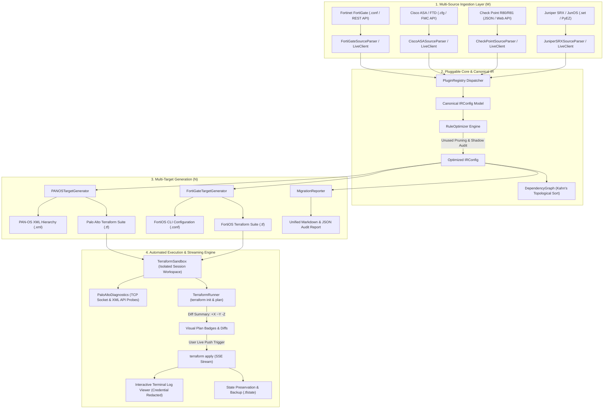

# Universal Multi-Vendor Firewall Migration Platform - Technical Architecture & Specifications

This document outlines the system architecture, ingestion pipelines, lexical analysis, intermediate representation (IR), rule optimization engine, generator backends, automated Terraform execution engine, web interface, and comprehensive test coverage.

---

## 1. High-Level Architecture & Repository Structure

The project implements an **$M + N$ Decoupled Intermediate Representation (`IRConfig`)** architecture with dynamic plugin discovery, automated rule optimization, and multi-vendor generation.

```
firewall-migration-tool/
├── dist/
│   └── Firewall Migration Tool.exe   # Standalone pre-compiled native Windows executable (single-file bundle)
├── run_migration.bat                 # Batch launcher for local web interface
├── USER_MANUAL.md                   # Complete operations guide and step-by-step user manual
├── pyproject.toml                    # Packaging, dependencies, and metadata
├── requirements.txt                  # Runtime dependencies (pydantic, lxml, pyyaml, click, flask, requests, pywebview, pyinstaller)
├── examples/                         # Reference multi-vendor configurations and output artifacts
│   ├── example_fortigate.conf        # FortiOS configuration backup
│   ├── example_cisco_asa.cfg         # Cisco ASA configuration backup
│   ├── example_checkpoint.json       # Check Point R80/R81 JSON database export
│   ├── example_juniper_srx.set       # JunOS SRX set syntax configuration
│   └── example_palo_alto.xml         # PAN-OS XML output reference
├── tests/                            # Comprehensive test suite (118 pytest tests)
│   ├── test_tokenizer.py             # Lexical analysis tests
│   ├── test_parser.py                # AST and recursive block parser tests
│   ├── test_fortigate_model.py       # Native FortiGate Pydantic model tests
│   ├── test_fortigate_api.py         # Live FortiGate REST API client tests
│   ├── test_cisco_asa_parser.py      # Cisco ASA offline parser & ACL tests
│   ├── test_checkpoint_parser.py     # Check Point JSON dump parser tests
│   ├── test_juniper_srx_parser.py    # JunOS SRX set syntax parser tests
│   ├── test_plugin_registry.py       # Plugin registry discovery and lookup tests
│   ├── test_optimizer.py             # Unused object pruning & shadowed rule tests
│   ├── test_fortigate_generator.py   # FortiOS CLI & Terraform target generator tests
│   ├── test_golden.py                # Parametrized multi-vendor golden tests
│   ├── test_multi_vendor_matrix.py   # 25-permutation M x N vendor matrix & UTM synthesis tests
│   ├── test_mock_api_integration.py  # Multi-vendor CLI & Web endpoint integration tests
│   ├── test_terraform_generator.py   # PAN-OS Terraform HCL generator tests
│   ├── test_binary_manager.py        # Standalone Terraform binary manager tests
│   ├── test_diagnostics.py           # Network & API pre-flight diagnostics tests
│   ├── test_runner.py                # Sandbox execution & SSE log streaming tests
│   ├── test_web.py                   # Flask REST API endpoints and stream tests
│   ├── test_report.py                # Unified Markdown audit report tests
│   └── test_integration.py           # End-to-end migration tests
└── src/fwmigrate/                       # Core application package
    ├── config.py                     # User runtime configuration & zone mappings
    ├── main.py                       # Click CLI entrypoints (migrate, serve, vendors)
    ├── web.py                        # Flask Web application & SSE live stream endpoints
    ├── templates/index.html          # Dynamic multi-vendor web console template
    ├── static/                       # Web static assets
    │   ├── style.css                 # Glassmorphic dark-mode CSS design system
    │   └── app.js                    # Client-side state, diagnostics, & preview visualizer
    ├── core/                         # Pluggable Architecture Core
    │   ├── base_parser.py            # BaseSourceParser ABC
    │   ├── base_api_client.py        # BaseAPIClient ABC
    │   ├── base_generator.py         # BaseTargetGenerator ABC & MigrationArtifact
    │   ├── base_deployer.py          # BaseDeployer ABC
    │   ├── registry.py               # PluginRegistry factory & discovery
    │   └── optimizer.py              # RuleOptimizer (unused pruning, duplicate detection)
    ├── parsers/                      # Source Vendor Parser Plugins (M)
    │   ├── fortigate/                # Fortinet FortiGate (.conf / REST API)
    │   ├── palo_alto/                # Palo Alto Networks PAN-OS (.xml / XML API)
    │   ├── cisco_asa/                # Cisco ASA / Firepower (.cfg / FMC API)
    │   ├── checkpoint/               # Check Point R80/R81 (JSON / Web API)
    │   └── juniper_srx/              # Juniper JunOS (set syntax / PyEZ)
    ├── generators/                   # Target Generator Plugins (N)
    │   ├── palo_alto/                # PAN-OS XML and Terraform HCL
    │   ├── fortigate/                # FortiOS CLI scripts and Terraform HCL
    │   ├── cisco_asa/                # Cisco ASA CLI (.cfg) and Terraform HCL
    │   ├── checkpoint/               # Check Point mgmt_cli (.sh) and Terraform HCL
    │   └── juniper_srx/              # JunOS SRX set commands (.set) and Terraform HCL
    ├── ir/                           # Vendor-Neutral Intermediate Representation
    │   ├── enums.py                  # Standardized address, service, NAT, and policy enums
    │   ├── core.py                   # IR Pydantic models (IRConfig, IRZone, IRPolicy, etc.)
    │   └── dependency.py             # Topological sorting & dependency graph resolution
    ├── engine/                       # Automated Terraform Execution & Diagnostics
    │   ├── binary_manager.py         # Self-healing Terraform CLI detector & downloader
    │   ├── diagnostics.py            # Pre-flight TCP, Registry, and XML API diagnostics
    │   └── runner.py                 # Sandbox isolation, diff parser, & SSE apply streamer
    └── report/
        └── migration_report.py       # Unified Markdown migration & audit reporter
```

---

## 2. End-to-End Data Pipeline Flow



---

## 3. Detailed Component Breakdown

### A. Pluggable Core Architecture (`src/fwmigrate/core/`)
1. **`BaseSourceParser` (`base_parser.py`)**: Abstract base class defining `vendor_id`, `display_name`, `file_extensions`, and `parse(content, zone_mapping) -> IRConfig`.
2. **`BaseAPIClient` (`base_api_client.py`)**: Abstract base class for live device extraction via REST/NETCONF APIs.
3. **`BaseTargetGenerator` (`base_generator.py`)**: Abstract base class defining target generation logic and standard `MigrationArtifact` models.
4. **`PluginRegistry` (`registry.py`)**: Central registry providing dynamic lookup (`get_parser`, `get_generator`, `get_api_client_cls`) and UI capability discovery (`list_source_vendors`, `list_target_vendors`).
5. **`RuleOptimizer` (`optimizer.py`)**:
   - `find_unused_objects()`: Discovers orphaned address and service objects not referenced in any policy or group.
   - `find_duplicate_objects()`: Detects overlapping/redundant object values.
   - `find_shadowed_rules()`: Analyzes rule ordering to identify policies completely shadowed by preceding broad rules.
   - `prune_unused_objects()`: Returns an optimized `IRConfig` free of dead code.

---

### B. Source Vendor Ingestion Plugins ($M$) (`src/fwmigrate/parsers/`)

1. **Fortinet FortiGate (`parsers/fortigate/`)**:
   - **Lexical Tokenizer (`tokenizer.py`)**: Tokenizes CLI keywords (`config`, `edit`, `set`, `next`, `end`), quoted strings, and multi-word lists.
   - **AST Parser (`parser.py`)**: Recursively constructs hierarchical `FGConfig` schema.
   - **Live REST Client (`api_client.py`)**: Extracts CMDB objects via `/api/v2/cmdb/` endpoints with token or session authentication.

2. **Cisco ASA / Firepower (`parsers/cisco_asa/`)**:
   - **Contextual Line-Block Scanner (`parser.py`)**: Parses section headers (`object network`, `object-group`, `access-list`, `access-group`, `nat`, `route`). Tracks block contexts and captures child statements (`host`, `subnet`, `range`, `fqdn`).
   - **ACL & Service Decomposer**: Converts Cisco extended access-lists into normalized policy rules, extracting source/destination objects, port operators (`eq`, `range`, `gt`, `lt`), and logging flags.
   - **FMC REST API Adapter (`api_client.py`)**: Adapts Cisco Firepower Management Center (FMC) REST API to `IRConfig`.

3. **Check Point R80/R81 (`parsers/checkpoint/`)**:
   - **JSON Dump Parser (`parser.py`)**: Ingests structured JSON databases generated by `mgmt_cli show-objects` and `show-access-rulebase`.
   - **UID & Reference Resolver**: Resolves group memberships, service ports, and rulebase matrices into typed `IRConfig` objects.
   - **Web Management API Adapter (`api_client.py`)**: Connects to Check Point Web API via `/web_api/login` and query endpoints.

4. **Juniper SRX / JunOS (`parsers/juniper_srx/`)**:
   - **Path-Token Matcher (`parser.py`)**: Decomposes hierarchical `set` statements (`security address-book`, `security zones`, `applications`, `security policies`) into structured paths.
   - **Multi-Line Policy Aggregator**: Combines multiple match criteria across separate lines into consolidated multi-source and multi-destination policy rules.
   - **PyEZ / NETCONF Adapter (`api_client.py`)**: Integrates with JunOS PyEZ RPC commands.

---

### C. Vendor-Neutral Intermediate Representation (IR) (`src/fwmigrate/ir/`)
- **`IRConfig` (`core.py`)**: Strongly-typed canonical data model containing `metadata`, `zones`, `interfaces`, `addresses`, `address_groups`, `services`, `service_groups`, `schedules`, `security_profile_groups`, `policies`, `nat_rules`, `vpn_tunnels`, and `routes`.
- **Universal Threat Inspection Model**: Normalizes UTM features across vendors into `IRSecurityProfileGroup` objects and rule-level links:
  - `antivirus`: Anti-malware inspection settings.
  - `vulnerability`: IPS, exploit, and protocol anomaly sensors.
  - `anti_spyware`: Command-and-control & DNS spyware protection.
  - `url_filtering`: Web categorization and URL filtering profiles.
  - `file_blocking`: Deep file extension and executable filtering.
  - `wildfire`: Zero-day cloud and on-prem sandboxing.
  - `ssl_decryption`: TLS/SSH decryption policies and certificate inspection profiles.
- **Topological Sorting (`dependency.py`)**: Employs Kahn's algorithm on directed acyclic dependency graphs (DAG) to ensure referenced address groups and service objects are created before parent referencing entities.

---

### D. Target Generation Plugins ($N$) (`src/fwmigrate/generators/`)

1. **Palo Alto Networks Target (`generators/palo_alto/`)**:
   - **XML Generator (`xml_generator.py`)**: Builds native PAN-OS 10.x/11.x hierarchical XML trees (`palo_alto_config.xml`) for direct Panorama / Firewall WebGUI import. Automatically synthesizes `<profile-group>` objects under `<vsys>` and references them in `<profile-setting>`, guaranteeing zero missing-reference commit failures.
   - **Terraform Generator (`terraform_generator.py`)**: Generates production-ready HCL code targeting the official `PaloAltoNetworks/panos` provider (~> 1.11), producing `provider.tf`, `variables.tf`, `terraform.tfvars.example`, and `main.tf`.

2. **Fortinet FortiGate Target (`generators/fortigate/`)**:
   - **CLI Generator (`cli_generator.py`)**: Emits native FortiOS CLI configuration scripts (`fortigate_config.conf`) with `config firewall address`, `config firewall service custom`, `config firewall profile-group`, `config firewall policy` (`set utm-status enable`), and `config router static`.
   - **Terraform Generator (`terraform_generator.py`)**: Generates modular HCL configurations targeting the official `fortinetdev/fortios` provider.

3. **Check Point Target (`generators/checkpoint/`)**:
   - **CLI Generator (`cli_generator.py`)**: Emits native Check Point `mgmt_cli` automation scripts with Access Layer rules and Threat Prevention Layer rules (`mgmt_cli add threat-rule layer "Standard Threat Prevention"`).

4. **Juniper SRX Target (`generators/juniper_srx/`)**:
   - **CLI Generator (`cli_generator.py`)**: Emits JunOS `set` syntax scripts defining address books, security policies, and `application-services utm-policy` bindings.

---

### E. Multi-Vendor Configuration Scope: Supported vs. Omitted Features

| Source Vendor | Supported / Converted Entities (🟢) | Intentionally Omitted Entities & Technical Rationale (🔴) |
|---|---|---|
| **Fortinet FortiGate** | • Security Policies (`firewall policy`)<br>• Address Objects & Groups (`firewall address/addrgrp`)<br>• Services & Groups (`firewall service custom/group`)<br>• SNAT Pools (`firewall ippool`)<br>• DNAT VIPs (`firewall vip/vipgrp`)<br>• Interfaces & Zones (`system interface/zone`)<br>• Static Routes (`router static`)<br>• IPsec VPN Tunnels (`vpn ipsec phase1/phase2`)<br>• Threat Prevention Profiles (AV, IPS, WF, SSL) | • **Hardware ASICs (`np6xlite`, `physical-switch`)**: Silicon chip hardware specific to Fortinet.<br>• **Replacement Messages (`replacemsg-*`)**: Vendor-proprietary HTML web proxy block pages.<br>• **Local Admin Users & UI (`system admin`, `gui-dashboard`)**: Admin RBAC is provisioned independently on destination device or via enterprise TACACS+/SAML.<br>• **High Availability (`system ha`, `standalone-cluster`)**: Hardware-bound FGCP/FGSP clustering protocols.<br>• **Edge DHCP Server (`system dhcp server`)**: Centralized on Windows/Infoblox servers; local pools configured on destination interfaces if needed.<br>• **Fabric & Telemetry (`automation-*`, `endpoint-control`)**: Proprietary Fortinet fabric connectors. |
| **Palo Alto Networks** | • Security Rules (`<security><rules>`)<br>• NAT Rules (`<nat><rules>`)<br>• Address Objects & Groups (`<address>`, `<address-group>`)<br>• Service Objects & Groups (`<service>`, `<service-group>`)<br>• Threat Profile Groups (`<profile-group>`)<br>• Interfaces & Zones (`<interface>`, `<zone>`)<br>• Virtual Router Routes (`<virtual-router>`)<br>• IPsec VPN Gateways & Tunnels (`<ike>`, `<tunnel>`) | • **Panorama Device-Group Tree**: Flattened into target firewall configuration or vsys.<br>• **Admin RBAC (`<mgt-config>`)**: Destination appliance management credentials.<br>• **Physical HA MACs (`<high-availability>`)**: Hardware-specific HA1/HA2 cabling.<br>• **GlobalProtect SSL VPN Portals**: Vendor-specific client VPN portal and certificate bindings. |
| **Cisco ASA / FTD** | • Access Control Lists (`access-list extended`)<br>• Network Objects & Groups (`object/object-group network`)<br>• Service Objects & Groups (`object/object-group service`)<br>• Twice & Object NAT (`nat source/destination`)<br>• Named Interfaces & IP (`interface`, `nameif`)<br>• Static Routes (`route`)<br>• IPsec Site-to-Site VPN (`crypto ikev2`, `tunnel-group`) | • **Interface Security Levels (`security-level`)**: Replaced by explicit zone-to-zone policies.<br>• **Hardware Failover (`failover lan`)**: Physical Active/Standby heartbeat cables.<br>• **ASDM Management Commands (`asdm history`)**: Java management tool preferences.<br>• **Legacy Inspection Engines (`class-map`, `policy-map`)**: Replaced by target Layer 7 App-ID. |
| **Check Point** | • Access Rulebases (`show-access-rulebase`)<br>• Address Objects & Groups (`show-objects`)<br>• Service Objects & Groups<br>• Source, Destination, and Static NAT<br>• Network Interfaces & Topology<br>• Static Routes<br>• Threat Prevention Layers (AV, IPS, Threat Emulation) | • **SmartConsole GUI Metadata (`color`, `icon`)**: Check Point management client display properties.<br>• **ClusterXL (`cphaconf`)**: Check Point proprietary sync clustering protocols.<br>• **SMS Database IDs (`uid`, `domain`)**: Internal database UUIDs. |
| **Juniper SRX** | • Security Policies (`security policies`)<br>• Address Books & Sets (`security address-book`)<br>• Applications & Sets (`applications application`)<br>• Source/Destination/Static NAT (`security nat`)<br>• Security Zones & Interfaces (`security zones`, `interfaces`)<br>• Static Routing (`routing-options static`)<br>• IKE Gateways & IPsec Tunnels (`security ike/ipsec`)<br>• UTM Policies (`security utm utm-policy`) | • **Chassis Cluster (`chassis cluster`)**: Hardware reth interfaces and control links.<br>• **Dynamic Routing Daemons (BGP/OSPF processes)**: Converted via static routes; dynamic neighbors configured on target routing instances.<br>• **System Login (`system login`)**: Local JunOS user accounts. |

5. **Cisco ASA / FTD Target (`generators/cisco_asa/`)**:
   - **CLI Generator (`cli_generator.py`)**: Emits Cisco ASA standard/extended ACLs, network/service object-groups, and static/dynamic NAT statements.

---

### E. Automated Execution & Diagnostics Engine (`src/fwmigrate/engine/`)
1. **`TerraformBinaryManager` (`binary_manager.py`)**:
   - Discovers local `terraform` binaries in PATH, `./bin/`, or inside the PyInstaller `_MEIPASS` bundle.
   - Automatically downloads official standalone releases from HashiCorp for Windows x64, Linux, and macOS.
2. **`PaloAltoDiagnostics` (`diagnostics.py`)**:
   - Executes pre-flight TCP line-of-sight socket probes on port 443.
   - Tests XML API authentication and extracts hardware info (`<show><system><info>`).
3. **`TerraformRunner` & `TerraformSandbox` (`runner.py`)**:
   - Isolates execution environments in session directories (`scratch/sessions/<id>`).
   - Parses plan diff summaries (`+X to add, ~Y to change, -Z to destroy`).
   - Streams live `terraform apply` logs via Server-Sent Events (SSE) with sensitive credential masking (`redact_sensitive()`).
   - Automatically archives timestamped state backups (`terraform.tfstate.backup_<timestamp>`).

---

### F. Web Interface & Configuration Intelligence Console
- **Dynamic Vendor Selection**: Interactive pill grid for instant source ($M$) and target ($N$) vendor switching.
- **Dynamic Bundle Descriptions**: Automatically customizes export package descriptions and feature cards depending on selected target vendor.
- **Configuration Intelligence Card**: Displays real-time object counts, orphan address/service stats, and shadowed policy alerts.
- **Interactive Rule Matrix Preview**: Searchable preview table displaying parsed security rules before export or live execution.
- **Live Deployment Stepper & SSE Console**: 3-step workflow (`Prepare` ➔ `Plan` ➔ `Live Push`) with real-time log streaming and sensitive masking.

---

### G. Standalone Native Desktop App Architecture (`pywebview` & PyInstaller)
1. **Native Desktop Engine (`pywebview`)**:
   - Integrates Microsoft Edge WebView2 control (`edgechromium` backend) natively on Windows 10/11.
   - Hosts the Flask WSGI application internally without requiring an external browser window, browser tabs, or address bars.
   - Configured with dedicated window properties (`1360x880` size, min-bounds, title, custom styling).
2. **PyInstaller Frozen Bundle Engine**:
   - Compiles Python 3, Flask, Pydantic, lxml, and all vendor plugins into a standalone single-file binary: `dist/Firewall Migration Tool.exe` (~53.7 MB).
   - Dynamic asset resolution via `sys._MEIPASS` for Jinja2 HTML templates and CSS/JS static assets.
   - Bundles `bin/terraform.exe` inside the executable archive, eliminating the need for separate runtime or CLI downloads.
   - Automatic execution branching: double-clicking launches the GUI desktop window; passing CLI arguments routes to Click commands.

---

## 4. Test Suite Summary

The repository includes **90 automated tests** verified via `pytest`:

| Test Module | Test Count | Coverage / Focus Area |
| :--- | :---: | :--- |
| `test_plugin_registry.py` | 3 | Plugin registration, retrieval, and vendor discovery |
| `test_optimizer.py` | 1 | Unused object pruning, duplicate detection, and shadowed rule analysis |
| `test_panos_parser.py` | 2 | PAN-OS XML offline configuration parser & live API schema mapping |
| `test_cisco_asa_parser.py` | 1 | Cisco ASA offline configuration parsing and IR transformation |
| `test_checkpoint_parser.py` | 1 | Check Point R80/R81 JSON database parsing and IR transformation |
| `test_juniper_srx_parser.py` | 1 | JunOS SRX set syntax parsing and IR transformation |
| `test_fortigate_generator.py` | 1 | FortiOS CLI syntax and Terraform HCL target generation |
| `test_cisco_asa_generator.py` | 1 | Cisco ASA CLI syntax and Terraform HCL target generation |
| `test_checkpoint_generator.py` | 1 | Check Point mgmt_cli script and Terraform HCL target generation |
| `test_juniper_srx_generator.py` | 1 | JunOS SRX set syntax and Terraform HCL target generation |
| `test_golden.py` | 5 | Parametrized golden configuration test cases for all 5 source vendors |
| `test_mock_api_integration.py` | 9 | Any-to-any cross-vendor CLI tests, `/api/vendors`, and `/api/preview` integration |
| `test_tokenizer.py` | 5 | Lexical scanning, quoted strings, comments, and multi-value tokens |
| `test_parser.py` | 5 | FortiGate AST and recursive block parser |
| `test_fortigate_model.py` | 6 | Native FortiGate Pydantic model validation |
| `test_fortigate_api.py` | 8 | Live FortiGate CMDB REST extraction and authentication |
| `test_terraform_generator.py` | 8 | PAN-OS Terraform HCL syntax, resource mapping, group dependencies |
| `test_binary_manager.py` | 4 | Standalone Terraform binary discovery and auto-downloading |
| `test_diagnostics.py` | 9 | Socket line-of-sight, registry check, XML API auth & keygen |
| `test_runner.py` | 5 | Sandbox lifecycle, plan diff parsing, credential masking, SSE apply |
| `test_web.py` | 10 | Flask web endpoints, preview, diagnostics, desktop launcher, and streaming |
| `test_report.py` | 2 | Unified Markdown audit report generation and JSON summary export |
| `test_integration.py` | 1 | End-to-end multi-format migration |
| **Total** | **90** | **All 90 Passing** |