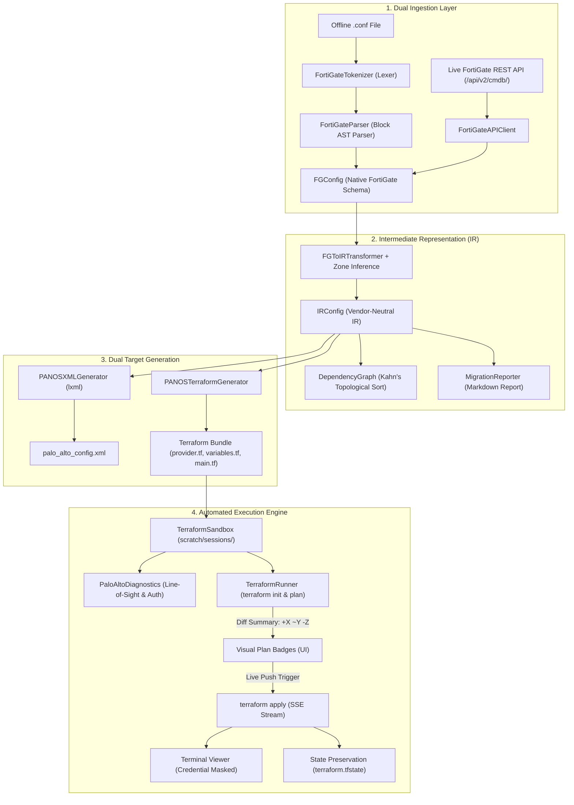

# Universal Multi-Vendor Firewall Migration Platform - Technical Architecture & Specifications

This document outlines the system architecture, ingestion pipelines, lexical analysis, intermediate representation (IR), generator backends, automated Terraform execution engine, web interface, rule optimizer, and test coverage.

---

## 1. High-Level Architecture & Repository Structure

The project implements an **$M + N$ Decoupled Intermediate Representation (`IRConfig`)** architecture with dynamic plugin discovery.

```
fortigate-to-palo/
├── run_migration.bat                 # Batch launcher for local web interface
├── pyproject.toml                    # Packaging, dependencies, and metadata
├── requirements.txt                  # Runtime dependencies (pydantic, lxml, pyyaml, click, flask, requests, jinja2)
├── examples/                         # Reference multi-vendor configurations and output artifacts
│   ├── example_fortigate.conf
│   ├── example_cisco_asa.cfg
│   ├── example_checkpoint.json
│   ├── example_juniper_srx.set
│   └── example_palo_alto.xml
├── tests/                            # Test suite (78 pytest tests)
│   ├── test_tokenizer.py             # Lexical analysis tests
│   ├── test_parser.py                # AST and recursive block parser tests
│   ├── test_fortigate_model.py       # Native FortiGate Pydantic model tests
│   ├── test_fortigate_api.py         # Live FortiGate REST API client tests
│   ├── test_cisco_asa_parser.py      # Cisco ASA offline parser & ACL tests
│   ├── test_checkpoint_parser.py     # Check Point JSON dump parser tests
│   ├── test_juniper_srx_parser.py    # JunOS SRX set syntax parser tests
│   ├── test_plugin_registry.py       # Plugin registry discovery and lookup tests
│   ├── test_optimizer.py             # Unused object pruning & shadowed rule tests
│   ├── test_fortigate_generator.py   # FortiOS CLI & Terraform target generator tests
│   ├── test_golden.py                # Parametrized multi-vendor golden tests
│   ├── test_mock_api_integration.py  # Multi-vendor CLI & Web endpoint integration tests
│   ├── test_terraform_generator.py   # PAN-OS Terraform HCL generator tests
│   ├── test_binary_manager.py        # Standalone Terraform binary manager tests
│   ├── test_diagnostics.py           # Network & API pre-flight diagnostics tests
│   ├── test_runner.py                # Sandbox execution & SSE log streaming tests
│   ├── test_web.py                   # Flask REST API endpoints and stream tests
│   ├── test_report.py                # Unified Markdown audit report tests
│   └── test_integration.py           # End-to-end migration tests
└── src/fg2pan/                       # Core application package
    ├── config.py                     # User runtime configuration & zone mappings
    ├── main.py                       # Click CLI entrypoints (migrate, serve, vendors)
    ├── web.py                        # Flask Web application & SSE live stream endpoints
    ├── templates/index.html          # Dynamic multi-vendor web console template
    ├── static/                       # Web static assets
    │   ├── style.css                 # Glassmorphic dark-mode CSS design system
    │   └── app.js                    # Client-side state, diagnostics, & preview visualizer
    ├── core/                         # Pluggable Architecture Core
    │   ├── base_parser.py            # BaseSourceParser ABC
    │   ├── base_api_client.py        # BaseAPIClient ABC
    │   ├── base_generator.py         # BaseTargetGenerator ABC & MigrationArtifact
    │   ├── base_deployer.py          # BaseDeployer ABC
    │   ├── registry.py               # PluginRegistry factory & discovery
    │   └── optimizer.py              # RuleOptimizer (unused pruning, duplicate detection)
    ├── parsers/                      # Source Vendor Parser Plugins (M)
    │   ├── fortigate/                # Fortinet FortiGate (.conf / REST API)
    │   ├── cisco_asa/                # Cisco ASA / Firepower (.cfg / FMC API)
    │   ├── checkpoint/               # Check Point R80/R81 (JSON / Web API)
    │   └── juniper_srx/              # Juniper JunOS (set syntax / PyEZ)
    ├── generators/                   # Target Generator Plugins (N)
    │   ├── palo_alto/                # PAN-OS XML and Terraform HCL
    │   └── fortigate/                # FortiOS CLI scripts and Terraform HCL
    ├── ir/                           # Vendor-Neutral Intermediate Representation
    │   ├── enums.py                  # Standardized address, service, NAT, and policy enums
    │   ├── core.py                   # IR Pydantic models (IRConfig, IRZone, IRPolicy, etc.)
    │   └── dependency.py             # Topological sorting & dependency graph resolution
    ├── engine/                       # Automated Terraform Execution & Diagnostics
    │   ├── binary_manager.py         # Self-healing Terraform CLI detector & downloader
    │   ├── diagnostics.py            # Pre-flight TCP, Registry, and XML API diagnostics
    │   └── runner.py                 # Sandbox isolation, diff parser, & SSE apply streamer
    └── report/
        └── migration_report.py       # Unified Markdown migration & audit reporter
```

---

## 2. End-to-End Data Pipeline Flow



---

## 3. Detailed Component Breakdown

### A. Dual Ingestion Layer
1. **Offline File Parser** (`tokenizer.py`, `fortigate_parser.py`):
   - Tokenizes FortiGate CLI keywords (`config`, `edit`, `set`, `next`, `end`, `append`).
   - Recursively traverses nested configuration blocks and builds validated `FGConfig` Pydantic models.
2. **Live REST API Client** (`fortigate_api.py`):
   - Queries `/api/v2/cmdb/` endpoints (`system/interface`, `firewall/address`, `firewall/addrgrp`, `firewall.service/custom`, `firewall/policy`, `firewall/ippool`, `firewall/vip`, `router/static`, `vpn.ipsec/phase1-interface`).
   - Supports bearer API tokens and session cookie authentication (`/logincheck`).

### B. Vendor-Neutral Intermediate Representation (IR)
- **`IRConfig`**: Root schema capturing normalized metadata, zones, interfaces, address objects, address groups, service objects, service groups, security policies, and NAT rules.
- **Topological Sorting (`dependency.py`)**: Uses Kahn's algorithm to resolve inter-group dependencies (e.g. nested address groups referencing other groups), preventing reference errors during PAN-OS provisioning.

### C. Target Generators
1. **`PANOSXMLGenerator` (`panos_xml.py`)**:
   - Generates PAN-OS 10.x/11.x XML snippet hierarchy ready for Panorama or PAN-OS device import.
2. **`PANOSTerraformGenerator` (`panos_terraform.py`)**:
   - Generates 4 clean artifacts:
     - `provider.tf`: Declares `PaloAltoNetworks/panos` (~> 1.11).
     - `variables.tf`: Parameterized hostname, credentials, vsys, and device group.
     - `terraform.tfvars.example`: Reference variable definitions.
     - `main.tf`: Declarative resources (`panos_address_object`, `panos_custom_url_category`, `panos_address_group`, `panos_service_object`, `panos_service_group`, `panos_zone`, `panos_static_route_ipv4`, `panos_nat_rule_group`, `panos_security_rule_group`).

### D. Automated Execution & Diagnostics Engine (`engine/`)
1. **`TerraformBinaryManager` (`binary_manager.py`)**:
   - Discovers existing `terraform` binaries in PATH or `./bin/`.
   - Automatically downloads official standalone releases from HashiCorp for Windows x64, Linux, and macOS.
2. **`PaloAltoDiagnostics` (`diagnostics.py`)**:
   - Executes pre-flight line-of-sight TCP socket probes on port 443.
   - Tests PAN-OS XML API authentication and extracts hardware info (`<show><system><info>`).
3. **`TerraformRunner` & `TerraformSandbox` (`runner.py`)**:
   - Isolates execution environments in session directories.
   - Parses plan diff summaries (`+X to add, ~Y to change, -Z to destroy`).
   - Streams live `terraform apply` logs via Server-Sent Events (SSE) with sensitive credential masking (`redact_sensitive()`).
   - Automatically archives timestamped state files (`terraform.tfstate.backup_<timestamp>`).

### E. Web Interface & Real-Time Live Migration UI
- Built with Flask (`web.py`), Jinja2 (`index.html`), Vanilla CSS (`style.css`), and JavaScript (`app.js`).
- Dual-mode tab navigation:
  - **Mode A: Download Migration Package (.zip)**: Generates and packages XML, Terraform `.tf` files, and Markdown audit reports.
  - **Mode B: Direct Live Migration (Terraform)**: Live console with pre-flight diagnostic cards, 3-step workflow stepper (`Prepare` ➔ `Plan` ➔ `Live Push`), and a dark-mode terminal log viewer.

---

## 4. Test Suite Summary

The repository includes **57 automated tests** verified via `pytest`:

| Test Module | Coverage / Focus Area |
| :--- | :--- |
| `test_tokenizer.py` | Lexical scanning, quoted strings, comments, multi-value tokens |
| `test_parser.py` | Recursive blocks, interface parsing, address & policy AST compilation |
| `test_fortigate_model.py` | Pydantic model validation and error handling |
| `test_fortigate_api.py` | Live CMDB REST extraction, authentication, and CLI live ingestion |
| `test_terraform_generator.py` | HCL syntax, resource mapping, group dependencies, wildcard FQDNs |
| `test_binary_manager.py` | Binary detection, auto-download mock, version extraction |
| `test_diagnostics.py` | Socket line-of-sight, registry check, XML API auth & keygen |
| `test_runner.py` | Sandbox lifecycle, plan diff parsing, credential masking, SSE apply |
| `test_web.py` | Flask endpoints, dual ingestion, diagnostics, plan/apply streaming, state download |
| `test_report.py` | Unified Markdown report generation and confidence rating calculations |
| `test_integration.py` | End-to-end multi-format migration |