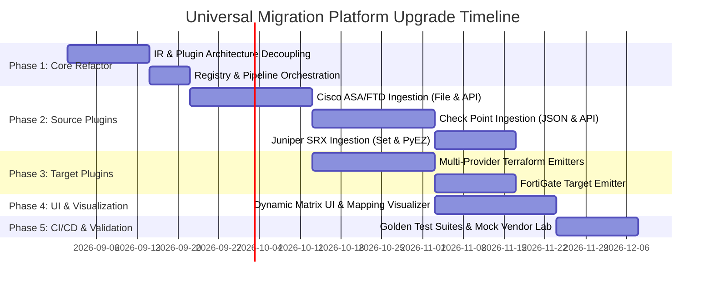

I have created a comprehensive, multi-phase technical roadmap to upgrade this engine into a **Universal Multi-Vendor Firewall Migration Platform**.

---

# 🚀 Universal Multi-Vendor Firewall Migration Engine: Upgrade Roadmap



---

## 📋 Architectural Overview

The engine adopts an **$M + N$ Decoupled Intermediate Representation (IR)** architecture. Rather than writing direct translators for every vendor pair ($M \times N$), all source parsers convert input into a canonical, vendor-neutral security model, and all target generators produce output from that standard model.

```
┌─────────────────────────────────────────────────────────────┐
│                 1. Source Ingestors (M)                     │
├───────────────┬────────────────┬───────────────┬────────────┤
│   FortiGate   │   Cisco ASA    │  Check Point  │Juniper SRX │
│ (.conf / API) │  (.cfg / FMC)  │ (.json / API) │(.set /PyEZ)│
└───────┬───────┴────────┬───────┴───────┬───────┴─────┬──────┘
        │                │               │             │
        └────────────────┼───────────────┴─────────────┘
                         ▼
┌─────────────────────────────────────────────────────────────┐
│          2. Canonical Intermediate Representation (IR)      │
├─────────────────────────────────────────────────────────────┤
│  Interfaces • Address Objects • Groups • Services •         │
│  Security Policies • NAT Rules (Source/Dest) • Static Routes│
└────────────────────────┬────────────────────────────────────┘
                         │
        ┌────────────────┼───────────────┬─────────────┐
        ▼                ▼               ▼             ▼
┌───────────────┬────────────────┬───────────────┬────────────┐
│   PAN-OS XML  │ Terraform HCL  │ FortiGate CLI │ Audit/Diff │
│  & Panorama   │ (Multi-Vendor) │  & API Push   │ JSON & CSV │
├───────────────┴────────────────┴───────────────┴────────────┤
│                 3. Target Generators (N)                    │
└─────────────────────────────────────────────────────────────┘
```

---

## 🛠️ Phase-by-Phase Roadmap

### Phase 1: Core Decoupling & Plugin Architecture (Weeks 1–3)
**Goal:** Abstract the existing codebase so source parsers and target generators are modular plugins registered via a central dispatcher.

- **1.1. Base Interfaces Definition:**
  - `BaseSourceParser`: Abstract interface requiring `parse_file(content)` $\to$ `IRConfig`.
  - `BaseAPIClient`: Abstract interface requiring `extract_config()` $\to$ `IRConfig` and `validate_connection()`.
  - `BaseTargetGenerator`: Abstract interface requiring `generate_package(ir_config, options)`.
  - `BaseDeployer`: Abstract interface for live deployment actions (Terraform CLI, Direct REST/XML Push).
- **1.2. Enhanced Canonical IR (`core/ir.py`):**
  - Standardize Zone mappings, Security Rules (Source/Dest/Service/Action/AppID), NAT (Source/Destination/Port Forwarding), Address objects (IP/Mask, FQDN, Range, Wildcard), and Static Routes.
- **1.3. Registry & Factory Pattern (`core/registry.py`):**
  - Implement dynamic discovery to register and retrieve parsers: `get_parser("cisco_asa")`, `get_generator("palo_alto")`.

---

### Phase 2: Source Vendor Extensibility (Weeks 4–11)
**Goal:** Add parsing and live API ingestion for the most popular enterprise firewalls.

#### 1. Cisco ASA / Cisco Firepower (FTD / FMC) (Weeks 4–6)
- **Offline Parser:** Integrate [`ciscoconfparse`](https://github.com/mpenning/ciscoconfparse) to parse nested `object network`, `object-group`, `access-list`, and `nat` statements into IR objects.
- **Live API Client:** Connect to Cisco Firepower Management Center (FMC) REST API (`/api/fmc_config/v1/domain/...`) or ASA REST API to extract live rulebases and network objects.

#### 2. Check Point R80.x / R81.x (Weeks 7–9)
- **Offline Parser:** Support Check Point JSON database dumps (exported via `mgmt_cli show access-rulebase --format json` / `show-objects`).
- **Live API Client:** Use the official [`checkpoint-api-python-sdk`](https://github.com/CheckPoint-Architects/checkpoint-api-python-sdk) to execute `login`, query CMDB rulebases, and transform objects to IR.

#### 3. Juniper SRX / JunOS (Weeks 10–11)
- **Offline Parser:** Parse JunOS `set security ...` and hierarchical curly-bracket configs into security zones, address books, and application sets.
- **Live Ingestion:** Connect via [`junos-eznc`](https://github.com/Juniper/py-junos-eznc) (PyEZ) / NETCONF RPC to pull live firewall configuration.

---

### Phase 3: Multi-Target Generation & Terraform Suite (Weeks 12–16)
**Goal:** Allow users to export configuration packages and Terraform files for any target platform.

- **3.1. Target Outputs:**
  - **Palo Alto Networks Target:** (Already active) PAN-OS XML, Panorama device-group XML, and `PaloAltoNetworks/panos` Terraform HCL.
  - **FortiGate Target:** Generate native FortiOS CLI syntax scripts (`config firewall address ...`) and `fortinetdev/fortios` Terraform HCL.
  - **Cisco Secure Firewall Target:** Generate FMC API import payloads and `CiscoDevNet/fmc` Terraform HCL.
  - **Vendor-Neutral Audit:** Generate Excel / CSV / Markdown migration compliance matrices and object mapping sheets.
- **3.2. Automated Rule Optimization Engine:**
  - Unused object pruning (remove orphan address/service objects not referenced in policies).
  - Duplicate object consolidation and shadowed rule detection.

---

### Phase 4: Modern Web UI Matrix & Visualizer (Weeks 17–19)
**Goal:** Upgrade the user interface to support dynamic source/target selection with live previews.

- **4.1. Source & Target Vendor Selector:**
  - Two intuitive dropdown/card selectors at the top:
    - `Source:` `[ FortiGate | Cisco ASA | Check Point | Juniper SRX ]`
    - `Target:` `[ Palo Alto Networks | FortiGate | Cisco FTD | Terraform Universal ]`
- **4.2. Dynamic Ingestion Form:**
  - Form dynamically adjusts fields based on selected source (e.g., API Token for FortiOS, FMC Domain UUID & credentials for Cisco, Session Token for Check Point).
- **4.3. Interactive Rule Mapping Visualizer:**
  - Side-by-side rule comparison table showing Source Policy vs. Target Policy before deployment.

---

### Phase 5: CI/CD, Golden Tests & Lab Validation (Weeks 20–21)
**Goal:** Ensure 100% conversion fidelity and zero syntax regressions.

- **5.1. Golden Configuration Test Suite:**
  - Real-world sanitized sample configs for every vendor (`samples/cisco_sample.cfg`, `samples/checkpoint_sample.json`, `samples/juniper_sample.set`).
  - Automated assertions comparing IR output against expected schemas.
- **5.2. Mock API Server:**
  - Containerized mock REST endpoints simulating FortiOS, Cisco FMC, and Check Point APIs for automated unit and integration tests in GitHub Actions.

---

## 📦 Suggested Technical Dependencies

```toml
# Recommended new dependencies in pyproject.toml
dependencies = [
    "ciscoconfparse>=1.9.0",         # Cisco ASA / IOS config parser
    "requests>=2.31.0",              # Universal HTTP REST client
    "urllib3>=2.0.0",                # SSL / socket control
    "junos-eznc>=2.7.0",             # Juniper PyEZ NETCONF client
    "checkpoint-api-python-sdk>=1.4",# Check Point Management API
    "pan-os-python>=1.11.0",         # Palo Alto XML / REST SDK
    "jinja2>=3.1.0",                 # Template engine for HCL / CLI generation
    "openpyxl>=3.1.0",               # Excel audit / migration reports
]
```

---

## 🎯 Recommended Next Steps

1. **Refactor Phase 1:** Decouple current `fg2pan/parser` into `parsers/fortigate/` and create the `core/registry.py` plugin loader.
2. **Prioritize Next Source Vendor:** Recommend starting with **Cisco ASA** as it is the most common enterprise firewall migrated to Palo Alto and Fortinet.
3. Would you like me to begin scaffolding the **Phase 1 Plugin Architecture** in this repository?